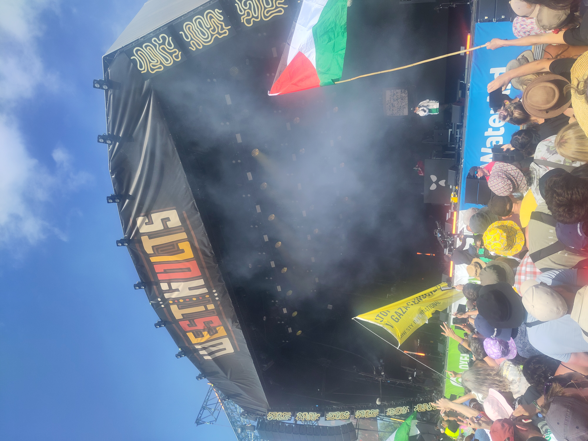

> Raw reflections triggered by the Kneecap set - for which I had a front row seat for every minute of that madness and mahem - the Bob Vylan debacle for which I was not present and the ensuing aftermath. Both in the mainstream media and in my mind, and the minds of memory fellow festival goers and the stumbled beaming with joy around Glastonbury Festival.
>
>
> Reflections on hate, love and the warped reflections of reality that our politicians and media try to curate, obfuscate and present to us.
>
> Reflections that I felt I had to express, after being questioned on my Code of Conduct at the W3C CCG meeting for suggesting folks watch the Kneecap set in full. For suggesting folks watch what really happened. Is that so bad?
>
> The words expressed in this post are my own. And are in no way meant to be a reflection of the views of my employer, Legendary Requirements, or any of the numerous organisations I represent such as the W3C. You can find out more about me, as a living, laughing, loving human by folling me on my fresh off the press substack distribution hub: [Words from Wip](https://wordsfromwip.substack.com/).

> I’m writing this from a place of genuine reflection and empathy. I fully understand this is an emotionally charged, complex, challenging topic to discuss. BUT. That is why we must discuss it. With kindness. With respect. With an open mind. Please give me that as you read these words from Wip.
>
> To be absolutely clear, my message and advocacy are grounded in peaceful dialogue, respect for human life, and an unwavering rejection of violence as a means of change.

Fair, yeah. Apologies for that.

Have you seen any of it by the way?

Are you at the Global Digital Conference in Geneva?

I'd appreciate a little chat about it to understand more. But I totally get where you are coming from.

I was at the Kneecap set, right at the front, all the way through. And personally, I didn't experience anything that I would have judged to controvene Code of Contact you quoted.

"Appreciate and accommodate our similarities and differences. We come from many cultures and backgrounds, ways of life, and standards of behavior. Cultural differences can encompass everything from official religious observances to personal habits to clothing. Be respectful of people with different practices, attitudes, and beliefs."

In fact, that sounds like something I can imagine Mo Chara saying on stage.

More than happy to chat. And I totally appreciate and respect that this is a charged, complicated topic.

But please respect that I actually lived through it. I was there. 

I would appreciate it if at least you would take the time to watch the set if you haven't already and then point out to where you think there are potential conflicts.

I think you owe me that.

Here is the URL: [https://www.bbc.co.uk/iplayer/episode/m002fbpw/glastonbury-kneecap](https://www.bbc.co.uk/iplayer/episode/m002fbpw/glastonbury-kneecap).

Unfortunately, it seems it only works in the UK. So you might need to use a VPN.

I also understand that it is further charged by the actions of the previous band, Bob Vylan. For which I was not present.

Some of the chants he lead did cross the line. 

However, I do see it slightly different than the mainstream media portrayed it.

Let's be clear, they chanted death to the Israeli Defence Force. The IDF.

To me, from my viewpoint at least. They are an organization aren't they? Sure, a strong powerful military government organization of one of our allies in this war against terrorists. Against Hamas right.

That's what the media show us. At least that's how it looks from my side of the pond.

Now, how would you feel if someone got up at Coachella, at Glastonbury, or indeed at any venue or gathering place of people. 

And chanted death to McDonald's. Or death to the W3C. Or even death to ICE.

You might think it strangely aggressive. Wonder what they have against the W3C or whatever.

But I don't think, and maybe I am wrong, you would think they were meaning death to you. Or indeed any living, loving human that is part of the W3C.

And even if you did, and took deep offence, could you not see that others would disagree with your interpretation of the meaning you have inferred from the words you heard.

Now, I will say again. I was at every second of kneecap. 

They didn't chant death to anyone.

I don't think Bob Vylan meant his words to be interpreted as death to every single human Israeli who is employed in the Israeli Defence Force. 

Maybe, we would have to ask him.

I think he meant death to the IDF. As an organization, with a pretty damming track record or sniping Palestinian children. 

Don't just take that from me. Hear it from the incredible podcast and media company This America Life. [Hear it from the US doctors and heros who volunteered in Gaza and compared notes when they returned.](https://www.thisamericanlife.org/859/transcript)

Also, where are the voices and stories of these Palestinian children, women, families and lovers from our narrative? Have you sought them out?

This American Life is good for that too. I recommed taking some time to listen to [this](https://www.thisamericanlife.org/834/transcript ) and [this](https://open.spotify.com/episode/73yLS4jXFKRaTqaG8nXBQH?context=spotify%3Aplaylist%3A37i9dQZF1FgnTBfUlzkeKt&nd=1&dlsi=62a682804ddc4c36) if you can.

Because it is absolutely critical, I cannot emphasize this enough, that we remember they are also living, laughing, loving human beings.

Just as the Israeli soldiers of the IDF are. We should empathize with each and every one of them. My heart goes out to them all.

Trapped and caught up in the long, ugly shadow of the past. The abused becoming the abuser played out at the scale of a society. 

TO BE CLEAR.

I could never, ever condone chanting that called for the death of any of the beautiful humans that I share this gorgeous world with.

However, I could condone the chanting for the death of the Wagner Group, Putin's authoritarian Russian State - but not Putin himself - and maybe through those eyes, the chanting for the death of an organization like the Israeli Defence Force isn't all as charged as the media would like to make it.

That is the thing. The slight of hand that they played. That had me fuming. The pure and blatant manipulation of reality through the selective presentation of facts distributed across digital media.

And that. That is what has got me so worked up that I felt I had to do something. 

To say something.

To say something to the Credentials Community Group. Who work on digital interaction technologies. Are deep and knowledgable about these matters. As I am.

As chair of both the Decentralized Identifier WG and Credentials Community Group at the W3C.

As someone with a [PhD in identity](https://drwip.com), in meaning making and the technologies that shape it.

As someone who was physically present in that moment.

I felt I had a duty to speak up. 

As you might be able to tell, I am someone who has thought deeply about this. Ever since that set ended, all throughout my stomping around the remainder of Glastonbury Festival. Gradually learning through the grapevine, how my other fellow festival goers also felt, how the media felt, how the rest of the world felt.

I understand the risks that speaking up entails. The political pressure that you come under.

If you do watch the Kneecap set, you might feel sorry for these wee Irish lads from West Belfast.

Then you might feel an overwhelming respect at their bravery.

To speak truth to power. To continue to do so in the face of all this pressure. Of all this anger. This vitriol. This hate.

That seems to permiate our world at the moment.

If you do watch the Kneecap set. You will realize that for all there lariness. For all there swearing. For all their "Fuck Starmer" chants. That are echoed with feeling by the crowd. By me.

Starmer has let me down big time. He has broken the bond of mutual trust that should exist between its citizens and government.

He doesn't represent me. What does he stand for.

Because I for one, do not know how a humanitarian lawyer who must know the reality can look himself in the mirror. Or his family in the eyes.

So yeah, Fuck Keir Starmer.

Doesn't mean I want him dead. I just want him out of my government.

Us Brits, as many of you who will know one, are bloody good people. We deserve better from our leaders. The whole world does practically.

> "We understand colonialism and we understand how important it is to support each other internationally," 

Wise words from Mr Mo Chara himself

If that is against the Code of Conduct at the W3C, then the code needs to be changed. I should be able to express my opinions about the political leaders who have the lives of our future generations in the balance.

And that's the thing.

If you do watch the Kneecap set. And please, I do emplor you to do so. The raw, unedited, uncut hour of it. Or if you can't give me an hour, at least watch the first five minutes. The opening of the set. It is thoughtful an powerfull.

You will see 3 lads from Ireland a country that has long been oppressed by its neighbors. Seeing what, at least to them, looks very similar happening over in the Middle East.

You will see them expressing themselves. Standing up for the Palestinian people. 

Dropping some truth bombs.

But that's the thing about truth bombs. They can't hurt any of us living, laughing, loving human beings. Accept maybe the egos of a few powerful men who cling on the the reins of power as they try to crush the uprising.

To everyone out there reading this. I say resist. Not with violence. Never with violence. But through spreading love and joy.

They won't know what to do. Don't let them try to stress you. We will win this fight.

And to Keir Starmer. To Netanyahu. To everyone who is desperately clinging on to these defunct realities. I say this.

I say this.

HISTORY WILL JUDGE YOU. SHAME ON YOU.

When, if, you do watch the Kneecap set. Be sure to look all round the faces of those in the crowd.

They are not angry faces. They are not baying for blood. They are not inviting and spreading hate.

Despite what the media would have you believe.

They are faces beaming. Suffused. Overflowing with Glastonbury festival joy.

And that's the thing you learn at a festival.

Joy trumps hate.

EVERY. SINGLE. TIME.

And let me tell you, from where I'm sitting, from how I see it. It is the politicians and the mainstream media that are spreading hate. That are manipulating and obfuscating the reality to construct a fabrication that suits their ends.

I was there. Your fabrication can't fool me. It won't fool a single soul who was in that West Holts field on Saturday afternoon.

So please, please, please. Watch the full, unedited hour of the kneecap set.

Then tell me how you really feel.

And finally. Because I know this has turned into a bit of a rant.

Why I feel this is even more important for groups like the CCG that I co-chair with Harrison and Mahmoud. Who I have cc'd into this email.

I would appreciate their alternative perspectives and voices on this.

Because, and this is key, there are a myriad a perspectives that make up our shared reality. That makes up this world. That we share.

With every living being on this planet.

We need to learn to share better. With all beings. With Israelis, with Palestinians, with arabs, with Jews, with Buddhists and atheists. Muslims and Christians.

All faiths and races from all different kinds of places.

Finally I will say, I hope something that we can agree with, but maybe not. Death to all ideologies sustain themselves through spreading hate and monopolizing violence.

Spread joy instead. It's more fun. More infectious. More sound.

Let's live in the present. Moment to moment. Try to find it in our hearts to have forgiveness for past wrongs and mistakes. Let's not let the past be a straight jacket on our futures possibilities. Our kids futures possibilities.

Join the joy revolution.

Thanks,

Follow me at [Words from Wip](https://wordsfromwip.substack.com/) on substack for more.

More words soon,
Wip x

Oh, and on a closing not. The Tune Catcher will leave you with a song that I think captures the essence of my message here. 

Love one another. Like sisters and brothers.

<iframe width="560" height="315" src="https://www.youtube.com/embed/X5xNXh4l4OA?si=lEXU831u1dBLKr0d" title="YouTube video player" frameborder="0" allow="accelerometer; autoplay; clipboard-write; encrypted-media; gyroscope; picture-in-picture; web-share" referrerpolicy="strict-origin-when-cross-origin" allowfullscreen></iframe>