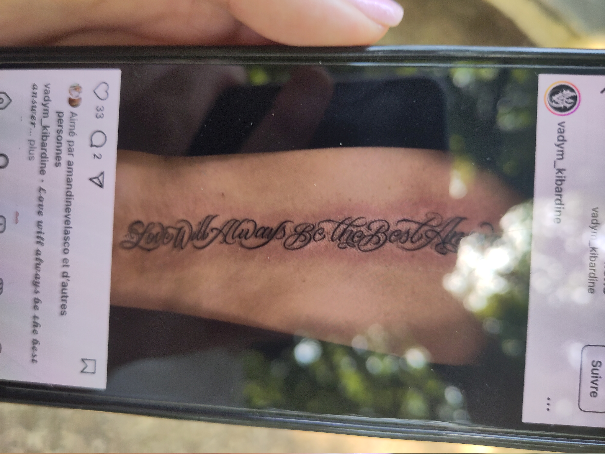
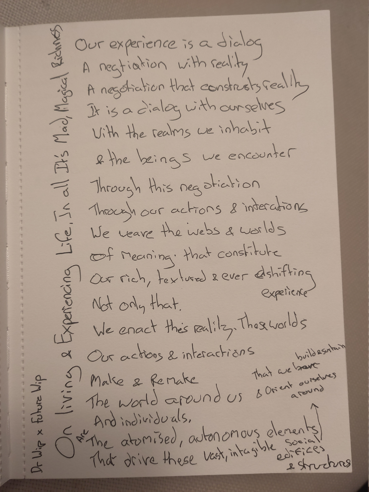

> It has been a wild, rollercoaster of a few days for me since seeing the Kneecap
> set at the West Holts stage of Glastonbury Festival. One that saw me write a heartfelt,
> [raw statement](https://futurewip.com/a-statement-on-gaza) and reflection drawing on my own experiences. 
> Then, further, reflect on this reflection, reflect on the feedback and input and conversations I have had around this statement with
> trusted colleges, allies and friends. Many different perspectives from all sides and standpoints 
> intersected within this defining issue of our era. Like every single one of us is. Inescapably so.
>
> This is a synthesis of the evolution of that thought.
>
> My sincere hope, that I want to push out into the world, is that through these words, and the words of others
> we can release the tension, and indeed the hate, that has built up in the world and its discourse. Over the last week,
> but also over the last years since the horrendous and unforgivable October the 7th atrocities by Hamas
> and the unfolding, heart-wrenching Israeli retalliation on the population, infrastructure and lands of Gaza.
>
> Can we all pause. Take a breath. And see each other as living, laughing, loving humans. Part of a family to which we should all have deep gratitude to belong.
> The family of humanity, the family of all living beings on the beautiful planet we call our home.
>
> Please. Read with an open mind and an open heart.

As the elders once told me, two amazing women that I don't know all that well, but respect deeply.

You should be allowed and free to chant whatever you want. It's a free world, words on their own can't cut deeply. Can't kill easily.

However, chanting death to anything. Is pushing violence and amplifying vitriol out into the world. I strongly believe what we push out we receive in return.

So instead of chanting death to the IDF. Chant fuck the IDF. Fucking is generally, a fun, enjoyable activity. Who knows, maybe our outpouring of love and joy can seduce even entities and ideologies like those of the IDF.

So no, I don't and will never condone chanting death to anything. Even ideas.

A wise man once told me, don't tell me what you are fighting against. Tell me what you are celebrating and striving towards.

The media and all those who have, in my considered, thoughtful opinion, blown this all out of proportion. Deliberately amplifying the hate and vitriol, that, I am sorry to say started, at least in this instance, with the chants of bob vylan and the glastonbury crowd. For which, you should all at least accept some responsibility. However to the media, to the politicians, to the prime minister. I say this.

SHAME ON YOU. HISTORY WILL JUDGE YOU. THAT IS A CERTAINTY.

finally let me close with these words .

LOVE WILL ALWAYS BE THE BEST ANSWER.

So go forth and spread some joy in the world.

To end, I have included a single, powerful photograph. Took by myself, with the consent of the incredible individual being photographed. Big love. Thank you. One day I hope our paths cross again. Wonderful to meet you x.

I have also selected a single, powerful, poignant song for the people from the Ezra Collective (remixing Future Utopia). That speaks to much of the same ideas I attempt to touch on in their own, special musical way. Be sure to pay attention to lyrics. Big love, what a band you guys are. What a Glasto set!

<iframe style="border-radius:12px" src="https://open.spotify.com/embed/track/0gSLaX91J2Cs9cWXqsRc4X?utm_source=generator" width="100%" height="352" frameBorder="0" allowfullscreen="" allow="autoplay; clipboard-write; encrypted-media; fullscreen; picture-in-picture" loading="lazy"></iframe>

Finally, I include a picture of a poem I wrote on my 7am flight over to Geneva for the [Global Digital Collaboration](https://globaldigitalcollaboration.org) conference on Tuesday morning. Proud and pleased with this one. It has been bubbling away for a while, but this is a blossoming more than I could have ever dreamed. Sometimes the universe really is out there beaming back at you.

For more words, follow me at [wordsfromwip.com](https://wordsfromwip.com)
