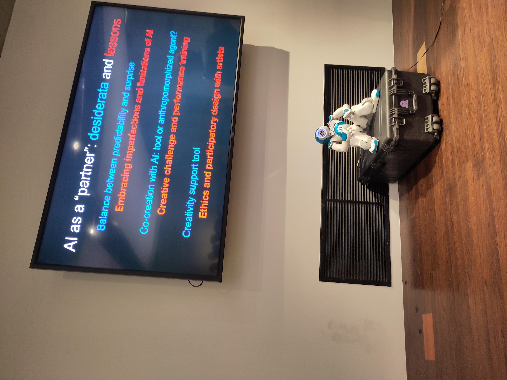
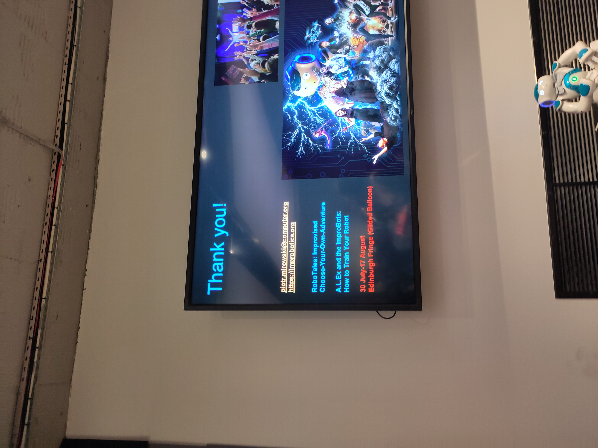
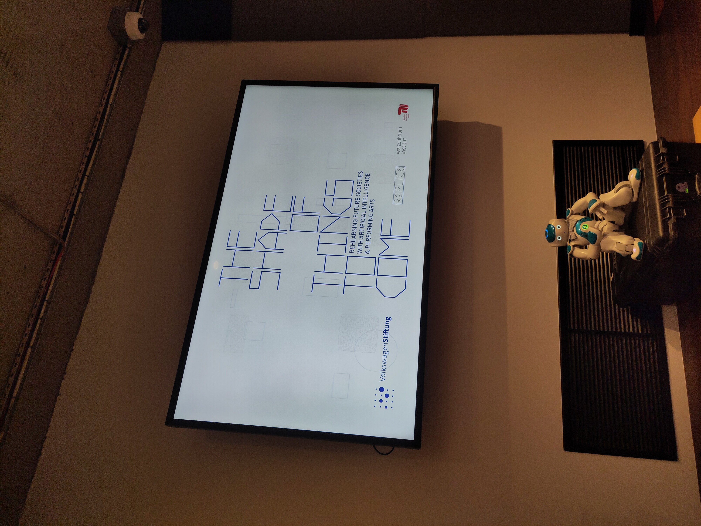
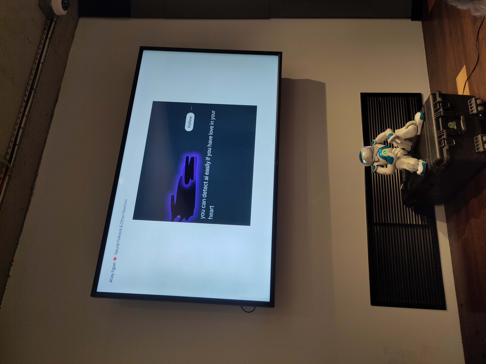
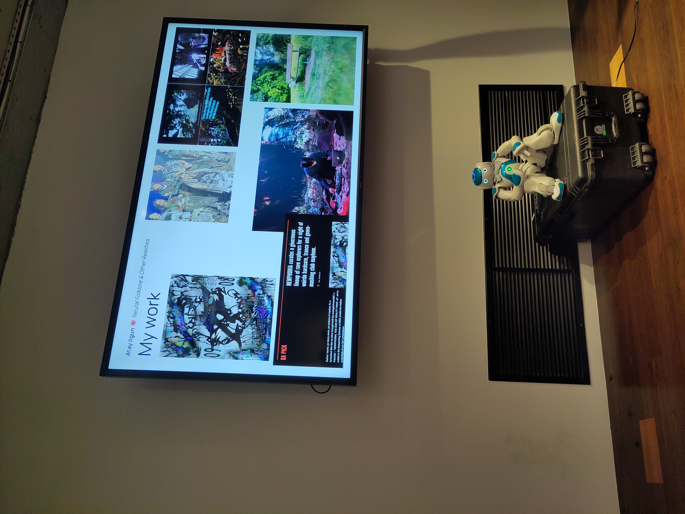

> These raw reflections were written directly after the meetup, my mind was alive with thoughts, ideas and gratitude. I felt I had to get something out.

Wow. What an [evening of mind bending, eye opening exploration of the possibilities of creative co-collaboration with artificial intelligences](https://lu.ma/exq4jj9y?tk=3nVHAn). What a time to be in London. It is clear, that the work being presented and being worked on is the culmination of years of playful experimentation by very, very smart people deep into the land of AI, CNNs, GANs, LLMs, etc, etc. I mean the [Creative AI meetup](https://lu.ma/3pjdt4tt) by [Luba Elliot](https://elluba.com/) first ran a series of meetups back in 2016 before taking a hiatus. I have to say, wonderful to have it back. The time definitely feels right and my does Luba know some fascinating folks. My thanks and appreciation for all the effort that must go into organizing these events.

Righto, let me get to it. Short, sweet, raw reflections from an epic meetup.

First up we had [Piotr Mirowski](https://piotrmirowski.com/), professionally from Deep Mind but humanly and playfully a improv actor behind the pioneering AI improv theatre lab [IMPROBOTICS](https://improbotics.org/). Together with fellow improvisor and AI expert Kory Mathewson they have been exploring since at least 2015 the intersection of improvisation and artificial intelligence, what great fun. [This article from Kory is a wonderful place to start](https://korymathewson.com/building-an-artificial-improvisor/). Also, if you have never been to an improv show, let me tell you right now, you are missing out. If you are in Edinburgh this August, you can even see an [IMPROBOTICS show](https://www.edfringe.com/tickets/whats-on/improbotics-presents-robotales). Plus hopefully coming to somewhere in London sometime soon. 

Piotr, seriously cool talk. I especially loved your vision for the future of AI dialogue, something along the lines of:

> "A multiparty chat with multiple people and AI intelligences talking over each other a once"

Messy and complex. Just like our lived experience. Just like we like it.

There is so much more I could mention, but you had to be there. The last thing I will say is how much I appreciated IMRPOBOTICS putting the "artist-in-the-loop". They are doing a fantastic job exploring how to make AI a partner in the co-creation process, embracing its imperfections while navigating the complex ethical quandaries these artificial collaborations raise.

Oh, finally, finally, its not all fun and games for Piotr. He has also published some deep academic papers on the topic with fascinating titles [^1][^2]

(P.S. Piotr - do say hi to Andrew for me, he will be tickled that we met I am sure)

Okay, moving swiftly on. This next talk was my favorite amongst favorites. So hard to pick one from this stellar line up. But the presentation, no the experience, that [Diana Serbanescu (a.ka Neranti)](https://diananeranti.com/) crafted for us resonated deeply with my soul. 

Welcome to London Neranti! I look forward to following your work more closely.

This was a performance and a ritual. An entrainment of embodied beings present in that moment. Through breathe, awareness and shared presence. Through poetry. Through dances at the edges of the world. By the way, Neranti, I just got and deeply appreciate that Ursula Le Guin reference. I have not read Dancing at the Edge of the World[^3] but I have read The Wave in the Mind[^4], which I understand is a similar vibe. Certainly the chapter Telling is Listening[^5] had a huge influence on me. Do be sure to follow her work at the [Replica Institute](https://replica.berlin/) in Berlin. Or the Shape of Things to Come.

Neranti, thank you. You are doing important, amazing work. I hope you continue exploring what it means for technology to remember and reinvent. I love the idea of re-wilding the senses. Yes. The world and all its lovely humans need that right now.

P.S. I hope you cherish my gift of the first edition of the first [ANOMALOUS THOUGHT FORM](atf.metalabel.com). It felt right and so aligned with the words you spoke and the directions seem to be are exploring.

The final talk of the evening was a wild dive into the creative, crazy imaginaries produced by [Atay Ilgun](https://www.chaindlk.com/interviews/atay-ilgun-wounded-wolf/). And yes, love will always be the best answer. Thank you!

What I loved about his work, was Atay is clearly a doer. He has wild, wacky, out there ideas. But, and this is important, he also has the technical chops and energy to breathe life into these ideas. To make them tangible. To share them with the world. So much funky stuff, I will let you explore for yourself. 

One highlight for me was his [Realiti art x cryto collection](https://opensea.io/collection/realitic) and how that evolved and took on a life of its own. He created his own virtual reality gallery in the [Metaplex](https://www.metaplex.com/) for this work and even held virtual raves. This even morphed into a real world exhibition and rave at [FOLD](fold.london), an epic nightclub in London. So cool to see these playful explorations take on a life of there own. 

**Never give up on your passion projects, you never know where they might lead you.**

With that pearl of wisdom I will close these reflections. Thanks to all the speakers, truly it was one of the most fascinating meetups I have ever been to. Thanks to Luba for curating this community and its lineup of events and speakers. Thanks to [IDEA London](https://www.idealondon.co.uk/) - daym, hot tip if you are looking for a casual co-working space this is the one. You even get a UCL email address to boot, which comes with some serious perks.