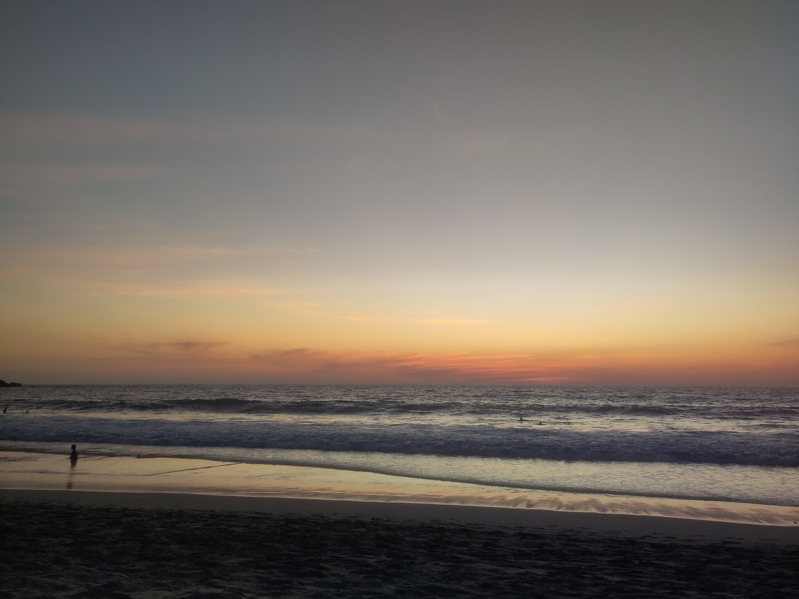

> A poem written to appreciate, share and remember a magical paradise on the Pacific. As well as an attempt to capture that special liminal space where the ocean meets the shore. I am mindful that these spaces are not guaranteed to be features of our future. The world's beaches are highly likely to be one of the casualties of catastrophic sea level rise induced by our changing climate. Will future generations get to enjoy the simple pleasure of walking along the shores of our beautiful planet?

<ul>
<li>A  delicious stretch of golden sand.</li>
<li>Surrounded by mountains,</li>
<li>Silhouetted against the sky.</li>
<li>The afternoon sun dances off the ocean.</li>
<li>Bathing the world in a warm orange glow.</li>
<li>A cool breeze drifts off the water.</li>
<li>Bringing with it the salty scent of the sea.</li>
<li>A blue green wall of water rises,</li>
<li>Towering ever higher above the surface.</li>
<li>Before curving, curling and crashing back down.</li>
<li>Leaving a trail of white flecked spray in its wake.</li>
<li>The sea explodes with a thundering roar,</li>
<li>Into a churning mass of white water.</li>
<li>That rushes towards the shore.</li>
<li>Gradually becoming gentler in its melodies.</li>
<li>A whooshing, burbling, tinkling sound.</li>
<li>Before fizzling out against the beach.</li>
<li>White, foamy water against dark golden sand.</li>
<li>The water retreats,</li>
<li>Drawing with it shimmering rivulets of sand.</li>
<li>Leaving a mirror-like sheen against the shore.</li>
<li>That beautifully reflects the setting sun.</li>
<li>A rich kaleidoscope of red and orange hues.</li>
<li>Continuing long after the sun dips below the horizon.</li>
<li>A magical performance in the sky.</li>
<li>The next wave crashes in the distance.</li>
<li>And on it goes.</li>
<li>The soothing symphony of the ocean.</li>
<li>Each receding wave rendering a canvas,</li>
<li>Of fresh, undisturbed sand.</li>
<li>Awaiting the latest set of ephemeral footprints.</li>
<li>Pressed into its firm, springy surface.</li>
<li>Savouring the sensation,</li>
<li>Of the cool sand against your feet.</li>
<li>As you traverse the liminal space,</li>
<li>Where the ocean meets the shore.</li>
</ul>

