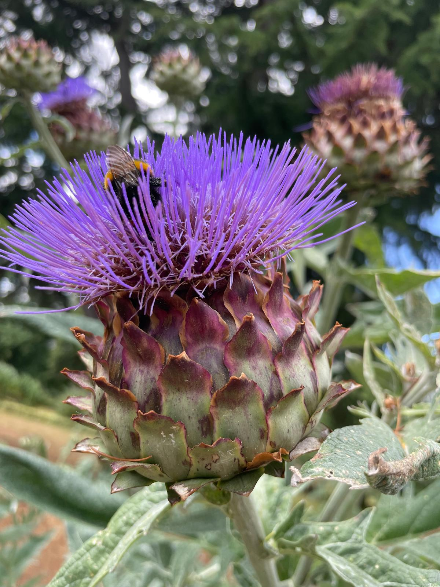

> With this big tree drop from the majestic Kew Gardens in London, I am both teasing a side project that has blossomed since Geneva - Tree Appreciation Walks - and unashamedly showing off the blog writing infrastructure I have developed over the last two weeks. This took me ~15 mins to put together. Stop it.

> This is a teaser, so far I have intentionally been on three Tree Appreciation Walks and have many more ahead of me in the future no doubt. I also will be creating a home for this content after snaffling up the domains: treeappreciationwalks.com and treeapprecation.com. Here I will be playing with memory, time and trees all while deeply appreciating one of the facets of this beautiful world we live in. Watch this space.

Wowowowowowow.

Mind blown. Twice in two days. First at the [Creative AI meetup](./creative-ai-london) in London.

<figure>
  
</figure>

Kew knows!

Some big, bad, beautiful trees to follow.

Welcome. You are in for a treat.

Today James and I went on an epic tree appreciation walk round Kew Gardens. They even planned out a route around some of the most remarkable trees in the garden. Sure many of them were most certainly pillaged from around the empire, but it doesn't mean we can't appreciate them.

Actually before we get started, let me give you some tunes to stick on if you like that kinda thing. I had company, and bloody good company at that, but if I didn't I wouldn't have gone too far wrong by sticking on Mr Marley's last album Uprising. Check out the real situation!

<iframe width="560" height="315" src="https://www.youtube.com/embed/nQqoeQPaHHk?si=kndksary20phX6Db" title="YouTube video player" frameborder="0" allow="accelerometer; autoplay; clipboard-write; encrypted-media; gyroscope; picture-in-picture; web-share" referrerpolicy="strict-origin-when-cross-origin" allowfullscreen></iframe>

Rich, let me walk you round this remarkable tree trail.

This lovely fella watching over the entrance. Where I met Sue, who signed me up for my annual membership. Bargain. I will be back many, many times.

<figure>
  
</figure>
First remarkable tree was this mighty Indian horse chestnut. Age unknown. Beauty clear for all to see.

<figure>
  
</figure>

<figure>
  
</figure>

<figure>
  
</figure>

For all these trees I loved the difference between viewing them from the outside and stepping beneath the cooling, calming canopy. Into the trees loving embrace.

Next up an Oriental plane from the 18th century.

<figure>
  
</figure>

<figure>
  
</figure>

<figure>
  
</figure>

Then we have a collection of trees not marked as remarkable, but certainly not unremarkable trees en route to the next marked tree.

<figure>
  
</figure>

<figure>
  
</figure>

This copper beech had a gorgeous canopy. Only showing the inside on this one, but you know she's a looker on the outside too.

<figure>
  
</figure>

<figure>
  
</figure>

<figure>
  
</figure>

<figure>
  
</figure>

Interrupting normal tree proceedings to bring you some stunning flora and fauna. Just look at this monster bumble bee chowing down on some sweet sweet Scottish nectar from a thistle on steroids.

<figure>
  
</figure>

<figure>
  
</figure>

<figure>
  
</figure>

<figure>
  
</figure>

Nice muscles.

<figure>
  
</figure>

Loved that they always had benches in the right places. Always go the interesting way!

<figure>
  
</figure>

Bengo: These are some excellent trees

Just more standard trees. Nothing to see here...

<figure>
  
</figure>

This fella does not look half as impressive as in the flesh, but it is the biggest oak in the UK I believe. Had to be there.

<figure>
  
</figure>

<figure>
  
</figure>

<figure>
  
</figure>

Also, lovely little through the canopy shot of an elegant lady.

<figure>
  
</figure>
Of the oak. A fascinating exhibition tuning in and showing the senses and sensations of a live, beautiful oak. Worth a visit. What if we could use AI to talk to trees? What stories might they tell us if they could? Something to ponder on. 

<figure>
  
</figure>

<figure>
  
</figure>

<figure>
  
</figure>

<figure>
  
</figure>
Nice ass!

<figure>
  
</figure>

Lakeside tree.

<figure>
  
</figure>

Little stroll down Acer alley.

<figure>
  
</figure>

<figure>
  
</figure>

<figure>
  
</figure>

<figure>
  
</figure>

Pagoda tree on life support. Still gloriously majestic. See it while ya can.

<figure>
  
</figure>

<figure>
  
</figure>

It's a real monkey puzzler.

<figure>
  
</figure>

<figure>
  
</figure>

<figure>
  
</figure>
Last one from me. Closing out with this giant gum of the mountains. Wow.

<figure>
  
</figure>

<figure>
  
</figure>

<figure>
  
</figure>

Cheers!

Hope you all enjoyed this mighty big deluge of delightful trees!

<figure>
  
</figure>

Peace!

Even brought this lil guy home with me.

<figure>
  
</figure>
James:

<figure>
  
</figure>

James: Magnificent bee in a truly massive thistle!

James:

<figure>
  
</figure>
Thanks for reading! As I said, watch this space. Tree Appreciating coming to trees near you soon. If your interested to learn more, drop me a line.
